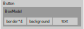

## Infrastructure

There are four levels of rendering layers from top to base:

* Layer 1: __control__
* Layer 2: __render tree__
    Each control corresponds with a sub-tree in the render tree. Each node on the render tree corresponds to a primitive.
* Layer 3: __primitive__
    The minimal abstract rendering unit: line-segments, rectangles, triangles, circles, polygon, ployline, arcs, bezier-curves, quadratic-curves and so on.
* Layer 4: __basic rendering API (interface)__
    Possible implementations:

    * [built-in] Path-based rendering API on top of OpenGL
    * cairo
    * other platform specific rendering API like Direct2D and Quartz

## Implementation Thoughts

* Brush: fill shapes with colors, images and patterns. It should be implemented in layer 2.
* Pen: draw outlines of a shape with colors, images and patterns. It should be implemented in layer 2.

__examples__

* Button  
  

* Slider  
  